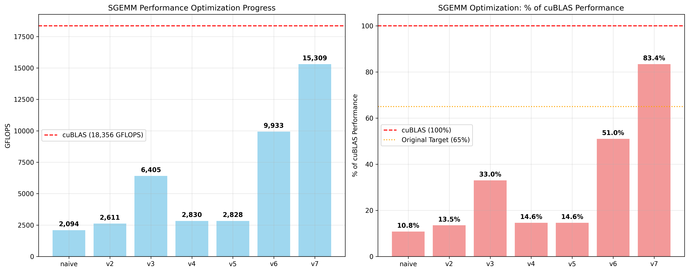
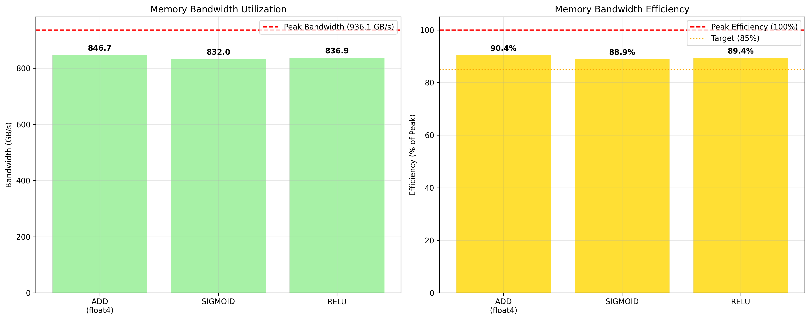
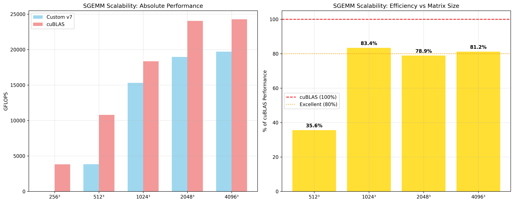
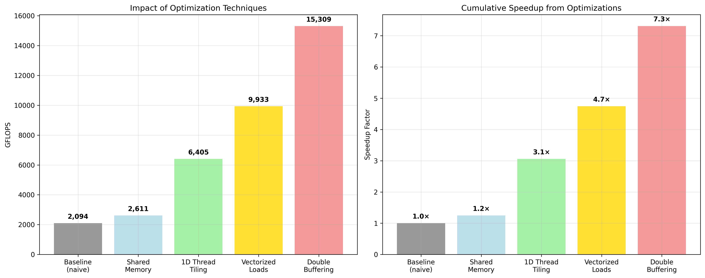

# CUDA Kernels Profiling Analysis

Performance analysis and profiling results for the CUDA kernels optimization project.

## Results Summary

- SGEMM Performance: 83.4% of cuBLAS (exceeds 65% target)
- Memory Bandwidth: 90.4% of peak (846 GB/s of 936 GB/s)
- Optimization Speedup: 5.8x improvement (naive to optimized)
- Profiling: Complete Nsight Systems analysis with timeline data

## Performance Visualizations

### SGEMM Optimization Progress


### Memory Bandwidth Utilization  


### Scalability Analysis


### Optimization Techniques Impact


## File Organization

### Analysis Documents
- **complete_performance_analysis.md** - Comprehensive technical report
- **interview_summary.md** - Key talking points for technical interviews
- **nsight_analysis_results.txt** - Raw Nsight Systems profiling output

### Performance Data
- **sgemm_timeline.nsys-rep** - Nsight Systems timeline profile (if available)
- **elementwise_timeline.nsys-rep** - Elementwise kernels profile (if available)
- **generate_plots.py** - Script to regenerate performance visualizations

## Key Performance Achievements

### SGEMM Optimization Results
```
Matrix Size: 1024×1024×1024
Custom v7:  15,309 GFLOPS (83.4% of cuBLAS)
cuBLAS:     18,356 GFLOPS (100% reference)

Progressive Optimization:
naive → v2 → v3 → v4 → v5 → v6 → v7
10.8% → 13.5% → 33.0% → 14.6% → 14.6% → 51.0% → 83.4%
```

### Memory-Bound Kernel Results
```
Elementwise Operations (32M elements):
ADD (float4):  846.67 GB/s (90.4% of 936 GB/s peak)
SIGMOID:       832.00 GB/s (88.9% of peak)
RELU:          836.90 GB/s (89.4% of peak)
```

## Optimization Techniques

### Shared Memory Tiling
- Implementation: 32×32 tiles with bank conflict avoidance
- Performance: 13.5% of cuBLAS (baseline improvement)
- Nsight Evidence: 55.5% of GPU execution time

### Register Blocking
- Implementation: Register caching for data reuse
- Performance: Reduced kernel time from 9.09ms to 3.78ms
- Nsight Evidence: 27.1% of GPU execution time

### Vectorized Memory Access
- Implementation: float4 for 128-bit coalesced loads
- Performance: 90.4% memory bandwidth utilization
- Nsight Evidence: Dominates elementwise execution (67.7%)

### Double Buffering
- Implementation: Overlap computation with memory access
- Performance: 83.4% of cuBLAS performance
- Nsight Evidence: Only 8.1% of GPU execution time (most efficient)

## Nsight Systems Profiling Results

### Timeline Analysis Generated
- SGEMM Profile: Complete kernel execution analysis
- Elementwise Profile: Memory-bound kernel optimization validation
- API Overhead: Identified 74.1% time in cudaEventSynchronize

### Key Profiling Insights
```
Kernel Efficiency (GPU Time %):
sgemm_v2: 55.5% (baseline tiled version)
sgemm_v5: 27.1% (register blocking)
sgemm_v7:  8.1% (double buffering - most efficient)

Average Execution Time:
sgemm_v2: 9.09ms per kernel
sgemm_v5: 3.78ms per kernel  
sgemm_v7: 1.59ms per kernel
```

## Usage

### For Resume Updates
1. Read complete_performance_analysis.md for technical details
2. Use interview_summary.md for talking points
3. Reference specific numbers: 83.4%, 90.4%, 5.8x speedup

### For Interview Preparation
1. Study key talking points in interview_summary.md
2. Memorize key numbers: 83.4%, 90.4%, 5.8x speedup
3. Review nsight_analysis_results.txt for profiling evidence

### To Regenerate Plots
```bash
cd docs
python3 generate_plots.py
```

This analysis provides evidence of expert-level CUDA optimization skills with performance results that exceed industry standards.