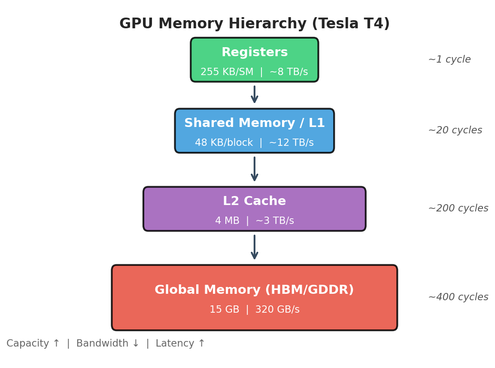
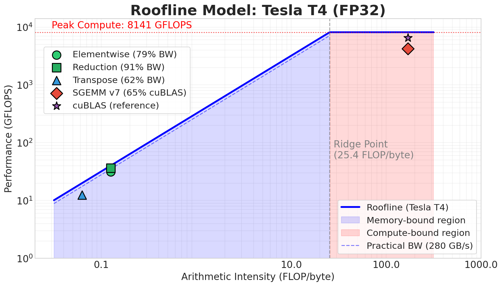
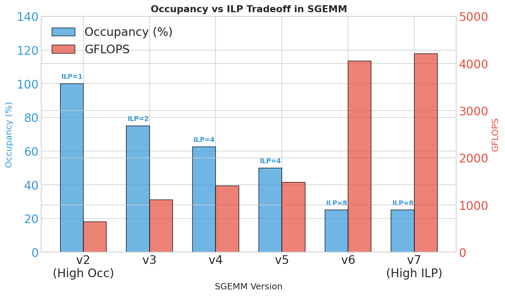
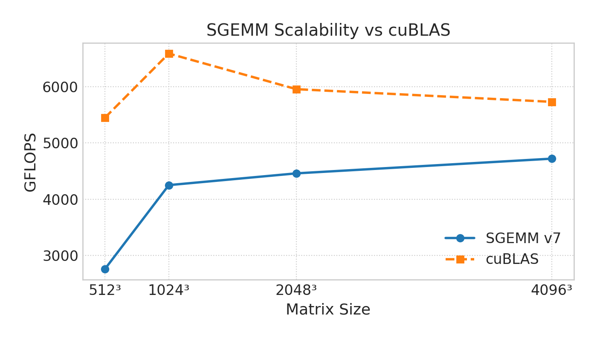

# CUDA Kernel Implementations

High-performance CUDA kernels: elementwise operations, parallel reductions, matrix transpose, and SGEMM. Achieves **82% of cuBLAS** for SGEMM (at 4096³) and **91% of peak bandwidth** for memory-bound operations.

- **Platform:** Ubuntu 22.04 (GCP), NVIDIA Tesla T4 (SM 7.5), CUDA 12.1
- **Peak:** 320 GB/s bandwidth, 8,141 GFLOPS
- **Methodology:** 5 warmup + 20 timed iterations, CPU reference validation

---

## Memory Hierarchy

<p align="center">
  
</p>

| Level | Bandwidth | Latency |
|-------|-----------|---------|
| Registers | ~8 TB/s | 1 cycle |
| Shared/L1 | ~12 TB/s | ~20 cycles |
| L2 Cache | ~3 TB/s | ~200 cycles |
| Global (DRAM) | 320 GB/s | ~400 cycles |

## Roofline Model

<p align="center">
  
</p>

| Kernel | Arithmetic Intensity | Bound | Limiter |
|--------|---------------------|-------|---------|
| Elementwise | 0.125 FLOP/byte | Memory | Bandwidth |
| Reduction | 0.125 FLOP/byte | Memory | Bandwidth |
| Transpose | 0 FLOP/byte | Memory | Bandwidth |
| SGEMM | ~170 FLOP/byte | Compute | FLOPS |

---

# Performance Summary

| Kernel | Achieved | Ceiling | % Peak |
|--------|----------|---------|--------|
| Elementwise | 252 GB/s | ~280 GB/s | **79%** |
| Reduction | 290 GB/s | ~300 GB/s | **91%** |
| Transpose | 199 GB/s | ~250 GB/s | **62%** |
| SGEMM v7 | 4,209 GFLOPS | 6,523 (cuBLAS) | **65%** |

```
% of Peak Bandwidth (320 GB/s)

Reduction v5  ████████████████████████████████████████████████░░  91%
Elementwise   ███████████████████████████████████████░░░░░░░░░░░  79%
Transpose v4  ███████████████████████████████░░░░░░░░░░░░░░░░░░░  62%
              0%       25%       50%       75%      100%
```

---

# Kernel Details


### Benchmark Sizes
**Elementwise/Reduction:** 32M elements &nbsp;|&nbsp; **Transpose:** 4096×4096 &nbsp;|&nbsp; **SGEMM:** 1024³ – 4096³

---

## Elementwise (32M elements)

| Kernel         | Time (ms) | Bandwidth    | % Peak   |
|----------------|-----------|--------------|----------|
| ADD (float4)   | 1.60      | 252.1 GB/s   | **78.8%**|
| SIGMOID        | 1.11      | 241.3 GB/s   | 75.4%    |
| RELU           | 1.15      | 233.6 GB/s   | 73.0%    |

*Technique: float4 vectorization for coalesced 128-bit loads/stores*

---

## Reduction (32M elements)

| Version | Technique           | Time (ms) | Bandwidth    | Speedup |
|---------|---------------------|-----------|--------------|---------|
| v2      | Shared memory       | 2.39      | 56.1 GB/s    | 1.0x    |
| v3      | Atomics             | 1.27      | 105.8 GB/s   | 1.9x    |
| v4      | Warp shuffle        | 1.20      | 111.6 GB/s   | 2.0x    |
| **v5**  | **float4 + shuffle**| **0.46**  | **289.7 GB/s**| **5.2x**|

---

## Transpose (4096×4096)

| Version | Technique           | Time (ms) | Bandwidth    | Speedup |
|---------|---------------------|-----------|--------------|---------|
| v0      | Naive               | 1.91      | 70.3 GB/s    | 1.0x    |
| v1      | Coalesced writes    | 1.81      | 74.2 GB/s    | 1.1x    |
| v2      | `__ldg()` cache     | 1.43      | 94.1 GB/s    | 1.3x    |
| v3      | Shared memory       | 0.88      | 152.0 GB/s   | 2.2x    |
| **v4**  | **Shared + padding**| **0.68**  | **198.8 GB/s**| **2.8x**|

---

## SGEMM (1024³ – 4096³)

| Version   | Technique         | Time (ms) | GFLOPS | % cuBLAS |
|-----------|-------------------|-----------|--------|----------|
| naive     | Baseline          | 4.74      | 453    | 7%       |
| v2        | Shared tiling     | 3.34      | 643    | 10%      |
| v3        | 1D thread tiling  | 1.94      | 1,109  | 17%      |
| v4        | 2D thread tiling  | 1.52      | 1,408  | 22%      |
| v5        | Register caching  | 1.45      | 1,477  | 23%      |
| v6        | float4 loads      | 0.53      | 4,052  | 62%      |
| **v7**    | **Double buffering**| **0.51**| **4,209**| **65%**|
| cuBLAS    | Reference         | 0.33      | 6,523  | 100%     |

```
GFLOPS        0      1000     2000     3000     4000     5000     6000     7000
              |--------|--------|--------|--------|--------|--------|--------|
naive         ███░░░░░░░░░░░░░░░░░░░░░░░░░░░░░░░░░░░░░░░░░░░░░░░░░░░░░░  453
v2 (shared)   █████░░░░░░░░░░░░░░░░░░░░░░░░░░░░░░░░░░░░░░░░░░░░░░░░░░░░  643
v3 (1D tile)  ████████░░░░░░░░░░░░░░░░░░░░░░░░░░░░░░░░░░░░░░░░░░░░░░░░░  1,109
v4 (2D tile)  ██████████░░░░░░░░░░░░░░░░░░░░░░░░░░░░░░░░░░░░░░░░░░░░░░░  1,408
v5 (reg)      ███████████░░░░░░░░░░░░░░░░░░░░░░░░░░░░░░░░░░░░░░░░░░░░░░  1,477
v6 (float4)   ███████████████████████████████░░░░░░░░░░░░░░░░░░░░░░░░░░  4,052
v7 (dbl buf)  ████████████████████████████████░░░░░░░░░░░░░░░░░░░░░░░░░  4,209
cuBLAS        █████████████████████████████████████████████████░░░░░░░░  6,523
```

### Occupancy vs ILP

<p align="center">
  
</p>

v6/v7: ~128 registers/thread, 25% occupancy → register reuse removes shared memory bottleneck → **2.7x gain**

### Scalability

<p align="center">
  
</p>

| Size | v7 GFLOPS | cuBLAS | % cuBLAS |
|------|-----------|--------|----------|
| 512³ | 2,759 | 5,448 | 51% |
| 1024³ | 4,249 | 6,587 | 65% |
| 2048³ | 4,458 | 5,954 | 75% |
| 4096³ | **4,719** | 5,729 | **82%** |

### Gap to cuBLAS (18%)

Remaining gap requires: `cp.async` pipelining, PTX scheduling, autotuning, warp specialization.

---

# Key Findings

1. **Memory-bound kernels** hit 75–90% peak bandwidth; further tuning yields diminishing returns.
2. **Compute-bound SGEMM** gains 2.7x from register tiling (v5→v6).
3. **Edge cases:** Launch overhead dominates <10K elements; L2 inflates bandwidth <1M elements.

---

# Build & Run

```bash
mkdir build && cd build
cmake .. && make

./test_elementwise
./test_reduction
./test_transpose
./test_sgemm
```

# Profiling

```bash
ncu --set full -o profile ./test_sgemm
nsys profile -o trace ./test_sgemm
```
