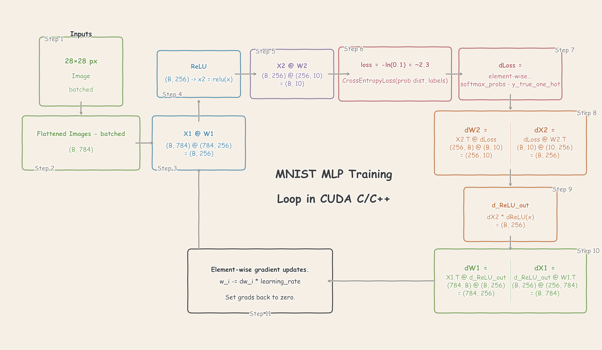
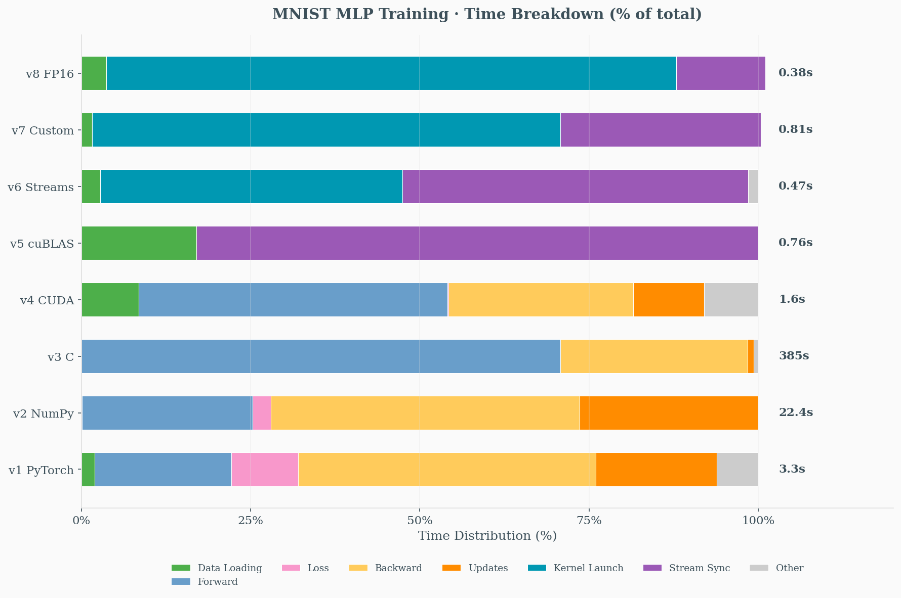

# MNIST in CUDA

This project implements a simple 2-layer MLP for MNIST digit classification, progressively optimizing from high-level PyTorch to low-level CUDA implementations.

- **Architecture:** 784 → 1024 → 10 (input → hidden → output)
- **Dataset:** 10,000 MNIST training samples, batch size 32, 10 epochs
- **Activation:** ReLU | **Loss:** Cross-entropy | **Optimizer:** SGD (lr=0.01)



## Tested Environment

| Component | Specification |
|-----------|---------------|
| Platform | Ubuntu 22.04 (GCP) |
| GPU | NVIDIA Tesla T4 (Compute Capability 7.5) |
| CUDA | 12.1 |

> **Note:** v8 (FP16) requires Tensor Core support (SM 7.0+). For Ampere GPUs, change `-arch=sm_75` to `-arch=sm_80`.

## Prerequisites

- Python 3.8+
- CUDA Toolkit 12.x
- NVIDIA GPU with Compute Capability 7.0+ (for Tensor Cores)

```bash
pip install -r requirements.txt  # torch, torchvision, numpy, matplotlib
```

## Usage

### Build with CMake (Recommended)

```bash
cd MNIST-in-CUDA
mkdir build && cd build
cmake .. && make -j

# Download MNIST data (run once)
python3 ../src/downloader.py

# Run any version
./bin/v3    # C baseline
./bin/v4    # Naive CUDA
./bin/v5    # cuBLAS
./bin/v6    # Streams + Fusion
./bin/v7    # Custom GEMM
./bin/v8    # FP16
```

### Build Individually

```bash
cd MNIST-in-CUDA/src
python3 downloader.py              # Download data (once)

python3 v1.py                      # PyTorch baseline
python3 v2.py                      # NumPy implementation
gcc -O2 -o v3 v3.c -lm && ./v3     # C implementation
nvcc -O2 -o v4 v4.cu && ./v4       # Naive CUDA
nvcc -O2 -lcublas -o v5 v5.cu && ./v5
nvcc -O2 -lcublas -o v6 v6.cu && ./v6
nvcc -O2 -lcublas -o v7 v7.cu && ./v7
nvcc -O2 -lcublas -arch=sm_75 -o v8 v8.cu && ./v8
```

## Version Progression

| Version | Description | Key Optimization |
|---------|-------------|------------------|
| [v1.py](src/v1.py) | PyTorch baseline | High-level API (`nn.Linear`, autograd); correctness reference |
| [v2.py](src/v2.py) | NumPy CPU | Manual forward/backward pass; demonstrates underlying math |
| [v3.c](src/v3.c) | Pure C | Naive O(n³) matmul; CPU baseline for GPU comparison |
| [v4.cu](src/v4.cu) | Naive CUDA | Custom kernels without shared memory tiling |
| [v5.cu](src/v5.cu) | cuBLAS | `cublasSgemm` + persistent GPU buffers |
| [v6.cu](src/v6.cu) | Streams & Fusion | Double-buffered streams + fused bias+ReLU kernel |
| [v7.cu](src/v7.cu) | Custom Tiled GEMM | 32×32 tiled GEMM with epilogue fusion |
| [v8.cu](src/v8.cu) | Pure FP16 | `cublasGemmEx` + Tensor Core acceleration |

## Performance Comparison

| Version | Implementation | Time | Speedup vs v3 | Final Loss | Test Accuracy |
|---------|---------------|------|---------------|------------|---------------|
| v1.py   | PyTorch CUDA  | 3.3s  | ~117x        | 0.144      | 93.40%        |
| v2.py   | NumPy CPU     | 22.4s | ~17x         | 0.142      | 93.77%        |
| v3.c    | Pure C        | 384.6s| 1x (baseline)| 0.144      | 92.64%        |
| v4.cu   | Naive CUDA    | 1.6s  | ~240x        | 0.143      | 92.44%        |
| v5.cu   | cuBLAS        | 0.76s | ~506x        | 0.142      | 93.68%        |
| v6.cu   | Streams+Fusion| 0.47s | ~818x        | 0.143      | 93.61%        |
| v7.cu   | Custom GEMM   | 0.81s | ~475x        | 0.143      | 93.63%        |
| v8.cu   | Pure FP16     | 0.38s | ~1012x       | 0.166      | 93.25%        |


## Timing Breakdown Analysis

<table>
<tr>
  <th>Version</th><th>Total</th><th>Data Loading</th><th>Forward</th><th>Loss</th><th>Backward</th><th>Updates</th><th>Other</th>
</tr>
<tr>
  <td>v1 PyTorch</td><td>3.3s</td><td>0.07s (2.0%)</td><td>0.67s (20.2%)</td><td>0.33s (9.9%)</td><td>1.45s (43.9%)</td><td>0.59s (17.9%)</td><td>0.20s (6.1%)</td>
</tr>
<tr>
  <td>v2 NumPy</td><td>22.4s</td><td>0.02s (0.1%)</td><td>5.66s (25.2%)</td><td>0.60s (2.7%)</td><td>10.22s (45.6%)</td><td>5.92s (26.4%)</td><td>0.03s (0.1%)</td>
</tr>
<tr>
  <td>v3 C</td><td>384.6s</td><td>0.00s (0.0%)</td><td>272.2s (70.8%)</td><td>0.00s (0.0%)</td><td>106.4s (27.7%)</td><td>3.38s (0.9%)</td><td>2.61s (0.7%)</td>
</tr>
<tr>
  <td>v4 CUDA</td><td>1.6s</td><td>0.14s (8.5%)</td><td>0.73s (46.3%)</td><td>0.00s (0.1%)</td><td>0.44s (27.6%)</td><td>0.17s (10.7%)</td><td>0.11s (6.8%)</td>
</tr>
<tr>
  <td>v5 cuBLAS</td><td>0.76s</td><td>0.13s (17.0%)</td><td colspan="4" align="center">0.63s GPU compute (83.0%)</td><td>0.00s (0.0%)</td>
</tr>
<tr>
  <td>v6 Streams</td><td>0.47s</td><td>0.01s (2.8%)</td><td colspan="2" align="center">0.21s kernel launch (45%)</td><td colspan="2" align="center">0.24s stream sync (52%)</td><td>0.00s (0.3%)</td>
</tr>
<tr>
  <td>v7 Custom GEMM</td><td>0.81s</td><td>0.01s (1.2%)</td><td colspan="2" align="center">0.56s kernel launch (69%)</td><td colspan="2" align="center">0.24s stream sync (30%)</td><td>0.00s (0.3%)</td>
</tr>
<tr>
  <td>v8 FP16</td><td>0.38s</td><td>0.01s (3.6%)</td><td colspan="2" align="center">0.32s kernel launch (83%)</td><td colspan="2" align="center">0.05s stream sync (13%)</td><td>0.00s (0.3%)</td>
</tr>
</table>

**v6-v8 Timing Note:** Due to async operations, timing shows:
- **Kernel launch**: Time to *submit* async H2D transfers and kernel launches to GPU (CPU returns immediately)
- **Stream sync**: Time *waiting* for GPU to finish (actual GPU execution time)

**"Other" Category:** Unmeasured overhead includes:
- Python interpreter overhead (v1)
- Epoch loop iteration, print statements
- CUDA context initialization (v4)
- Memory allocation outside timed sections




## Performance Insights

- **Memory Management:** Persistent buffers (v5) vs per-batch allocation (v4) cuts time by 2× (1.6s → 0.76s)
- **Library Optimization:** cuBLAS provides highly optimized GEMM that outperforms naive CUDA kernels by 2×
- **Async Overlap:** Double-buffered streams (v6) hide H2D latency, reducing time by 38% (0.76s → 0.47s)
- **Precision Trade-off:** FP16 (v8) achieves 1012× speedup with minor accuracy loss (93.68% → 93.25%)
- **Custom vs Library:** Custom tiled GEMM (v7) is slower than cuBLAS (0.81s vs 0.47s) but educational
- **Numerical Stability:** Proper softmax implementation with max subtraction prevents overflow

## Case Study: Resolving Row-Major vs Column-Major Memory Layout Bug


First run of v7.cu showed **exploding loss** and random accuracy:
```
Epoch 0 loss: 2.3795
Epoch 1 loss: 2.4138
...
Epoch 9 loss: 14.3912   ← Should decrease, not increase!
Test Accuracy: 8.05%    ← Random guessing (10 classes)
```

### Analysis

**1. Identify the Problem Type**
- Loss *increasing* = gradients flowing in wrong direction or corrupted data
- ~10% accuracy = model outputting random predictions
- This is NOT a hyperparameter issue — it's a **correctness bug**

**2. Narrow Down the Cause**
- v6 (cuBLAS) works fine → bug is in custom GEMM kernel
- Backward pass uses cuBLAS → bug is in **forward pass**
- Custom kernel computes `Y = A @ B + bias` → check memory layout

**3. Root Cause: Row-Major vs Column-Major Mismatch**

cuBLAS uses **column-major** storage (Fortran convention):
```
Matrix W[M, N] column-major: W[i,j] = W[i + j*M]
```

My kernel assumed **row-major** for weights:
```c
// WRONG: assumed B is column-major [K, N]
Bs[ty][tx] = B[b_row + col * K];  // B[k + hidden * INPUT_SIZE]

// CORRECT: cuBLAS stores W as column-major [N, K] = [HIDDEN, INPUT]
Ws[ty][tx] = W[row + w_col * M];  // W[hidden + input * HIDDEN_SIZE]
```

**4. Additional Issues Found**
- **Bias indexing:** `bias[col]` vs `bias[row]` — bias is per output feature, not per batch
- **Softmax input:** Expected row-major `[batch, classes]`, got column-major `[classes, batch]`
- **Grid dimensions:** Had `(HIDDEN, batch)`, should be `(batch, HIDDEN)` for correct `blockIdx` mapping

### The Fix

Changed kernel convention to match cuBLAS column-major layout:
```c
// FC operation: Y[out, batch] = W[out, in] @ X[in, batch]
// All matrices stored column-major to match cuBLAS

__global__ void fused_gemm_bias_relu_kernel(
    const float* W,    // [M, K] column-major (M=out_features, K=in_features)
    const float* X,    // [K, N] column-major (K=in_features, N=batch)
    const float* bias, // [M]    (per output feature)
    float* Y,          // [M, N] column-major
    int M, int K, int N, bool apply_relu
) {
    // W access: W[row, k] = W[row + k * M]
    // X access: X[k, col] = X[k + col * K]
    // Y write:  Y[row, col] = Y[row + col * M]
    // bias:     bias[row] (not bias[col]!)
}
```

### Lessons Learned

1. **BLAS is column-major** — always. When mixing custom kernels with cuBLAS, match their convention.

2. **Check dimensions carefully:**
   - `Y = W @ X` (BLAS style) vs `Y = X @ W` (ML style) have different shapes
   - Grid dimensions `(gridX, gridY)` must match output layout `(cols, rows)`

3. **Bias is per-feature, not per-sample:**
   - FC layer: `y[batch, feature] = ... + bias[feature]`
   - In column-major with output `[M, N]`: use `bias[row]` where `row` indexes features

4. **Debug strategy for "loss exploding":**
   - Loss increasing = correctness bug (not hyperparameter tuning)
   - Isolate: which pass (forward/backward)? which kernel?
   - Compare intermediate values with working reference (v6)

